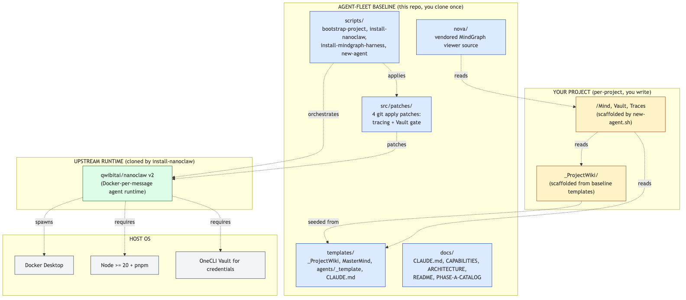
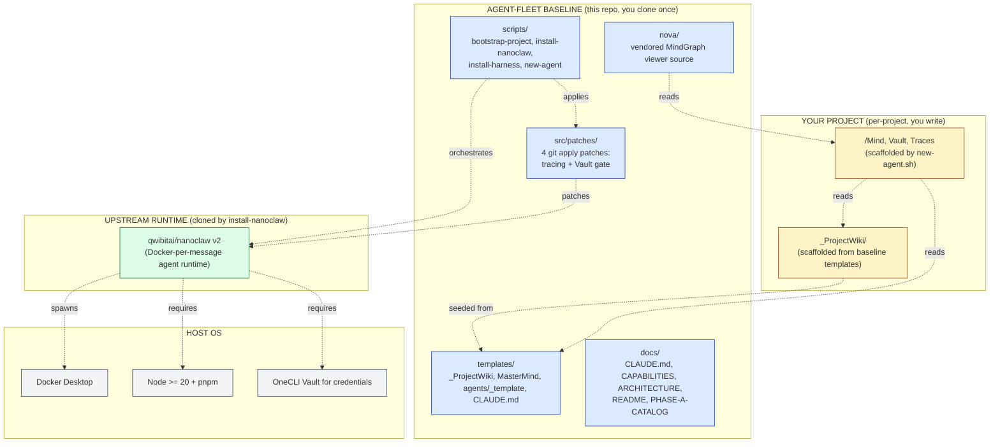
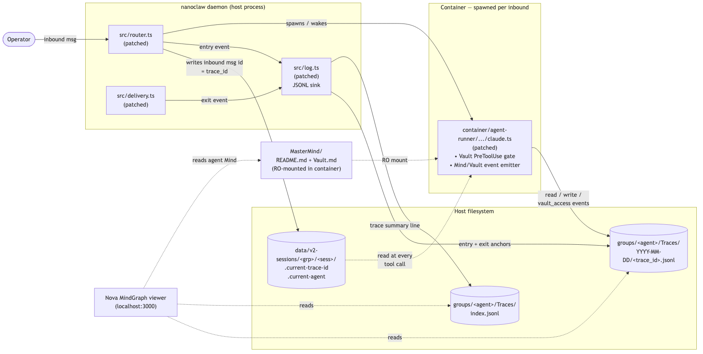
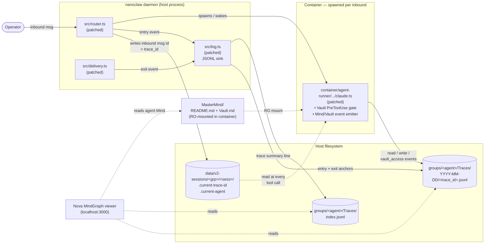
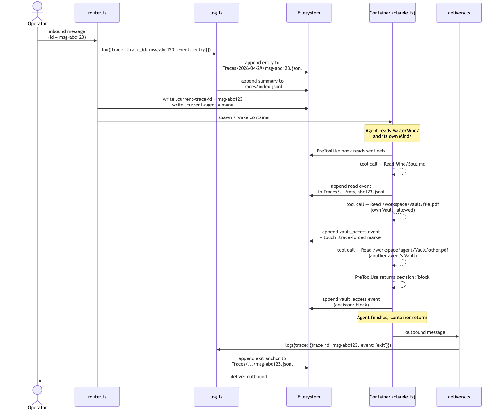
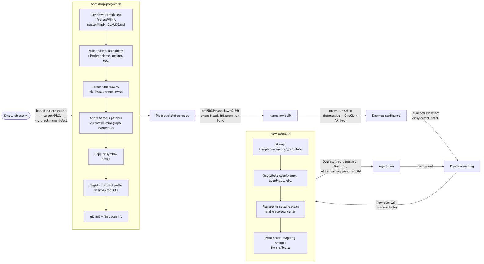
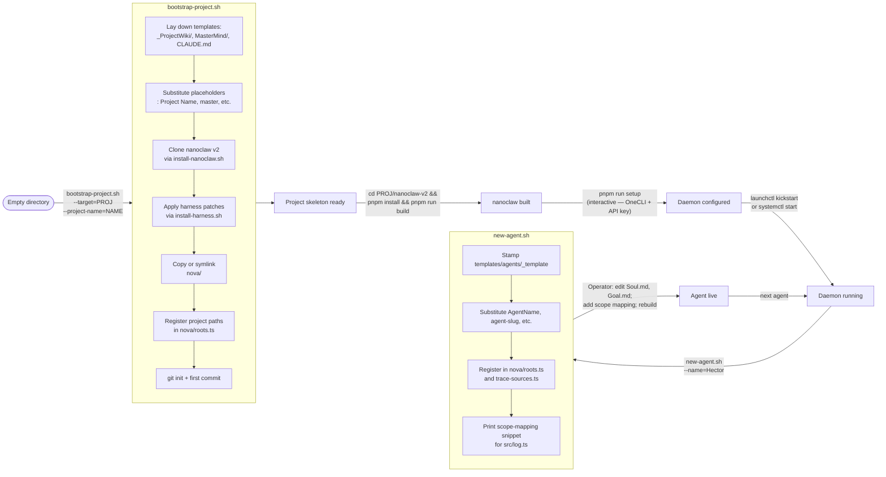

# Architecture

This document is the visual + conceptual reference for the agent-fleet baseline. It complements [CAPABILITIES.md](CAPABILITIES.md) (which is the prose walkthrough) by showing the four layered views any operator or LLM should be able to hold in their head:

1. **Layered stack** — what sits on what.
2. **Runtime topology** — what's running where, and how the pieces talk.
3. **Data flow** — how an inbound message becomes a JSONL trace.
4. **Project lifecycle** — how a new project bootstraps, evolves, and adds agents.

Each section embeds a Mermaid diagram (renders natively on GitHub) and a PNG fallback in [`docs/diagrams/`](docs/diagrams/) for offline viewing.

---

## 1. Layered stack

What this baseline aggregates and where each layer comes from.





**Reading the diagram:**

- **Yellow = your project.** Per-project content you write: project wiki entries, per-agent Mind/Vault/Traces.
- **Blue = baseline.** This repo. Cloned once; provides everything below the project layer.
- **Green = upstream.** `qwibitai/nanoclaw` v2 — the runtime. The baseline patches it but doesn't fork it.
- **Grey = host.** Docker, Node, OneCLI — system-level prereqs.

The dotted arrows show *uses-via-read* relationships, not import dependencies. The baseline does not run any code at install time except the scripts you invoke.

---

## 2. Runtime topology

Once installed, what's running and how the pieces communicate.





**Solid arrows** are write paths. **Dotted arrows** are reads. Everything coordinates via the host filesystem — no extra IPC, no new ports, no new daemons.

The five patched files (`router.ts`, `delivery.ts`, `log.ts`, `claude.ts`, `container-runner.ts`) are the only code surface area the harness touches. Everything else (MasterMind, wiki conventions, Nova) is text the operator and the agents consume.

---

## 3. Data flow

How a single inbound message produces a paired entry/exit JSONL trace.



```mermaid
sequenceDiagram
    actor Op as Operator
    participant R as router.ts
    participant L as log.ts
    participant FS as Filesystem
    participant C as Container (claude.ts)
    participant D as delivery.ts

    Op->>R: inbound message<br/>(id = msg-abc123)
    R->>L: log({trace: {trace_id: msg-abc123, event: 'entry'}})
    L->>FS: append entry to<br/>Traces/2026-04-29/msg-abc123.jsonl
    L->>FS: append summary to<br/>Traces/index.jsonl
    R->>FS: write .current-trace-id = msg-abc123<br/>write .current-agent = &lt;scope&gt;
    R->>C: spawn / wake container

    Note over C: Agent reads MasterMind/<br/>and its own Mind/

    C->>FS: PreToolUse hook reads sentinels
    C-->>C: tool call — Read Mind/Soul.md
    C->>FS: append read event<br/>to Traces/.../msg-abc123.jsonl
    C-->>C: tool call — Read /workspace/vault/file.pdf<br/>(own Vault, allowed)
    C->>FS: append vault_access event<br/>+ touch .trace-forced marker
    C-->>C: tool call — Read /workspace/agent/Vault/other.pdf<br/>(another agent's Vault)
    C->>C: PreToolUse returns decision: 'block'
    C->>FS: append vault_access event<br/>(decision: block)

    Note over C: Agent finishes, container returns

    C->>D: outbound message
    D->>L: log({trace: {trace_id: msg-abc123, event: 'exit'}})
    L->>FS: append exit anchor to<br/>Traces/.../msg-abc123.jsonl
    D->>Op: deliver outbound
```

**Two-layer event emission.** Anchor events (`entry`, `exit`) come from the host (router + delivery → log). Intermediate events (`read`, `write`, `vault_access`) come from the container's PreToolUse hook in `claude.ts`. They share the same `trace_id` because the container reads it from the sentinel file the host wrote moments before spawning it.

**Why sentinels and not env vars or stdin?** Containers in nanoclaw v2 are coalesced — the same container can answer multiple inbounds in succession to amortize spawn cost. Env vars would be set once at spawn; sentinels are re-written by the host on every inbound, so the container always sees the trace_id of the *current* inbound, not the one that spawned it.

---

## 4. Project lifecycle

How a new project goes from "empty directory" to "live agent fleet."





**Key checkpoints in the lifecycle:**

- After **bootstrap-project.sh** completes: the project is structurally complete but nothing is running yet. nanoclaw is cloned and patched but unbuilt. Nova is in place but not started.
- After **`pnpm run setup`** (a nanoclaw-native step, not part of this baseline): credentials are provisioned, channels can be wired.
- After **`launchctl kickstart`** / **`systemctl start`**: the daemon is running and ready to route inbounds. Nova viewer can be started separately (`cd nova && pnpm run dev`).
- After **new-agent.sh** + manual scope-mapping edit + rebuild: the agent has a Mind, a Vault, registered scopes, and emits traces on its first inbound.

Adding the second, third, Nth agent is the same `new-agent.sh` flow — the harness scales horizontally without further infrastructure changes.

---

## Where each component lives

| Concern | File / folder | Layer |
|---|---|---|
| Tracing helpers + JSONL sink | `src/patches/01-log.ts.patch` | Baseline patch into nanoclaw |
| Sentinel writes + entry events | `src/patches/02-router.ts.patch` | Baseline patch into nanoclaw |
| Exit events | `src/patches/03-delivery.ts.patch` | Baseline patch into nanoclaw |
| Vault gate + intermediate events (supports flat + `Mind/` subfolder layouts) | `src/patches/04-claude.ts.patch` | Baseline patch into nanoclaw |
| Three-layer Mind/Vault/Traces nested binds (per-agent install model) | `src/patches/05-container-runner.ts.patch` | Baseline patch into nanoclaw |
| MindGraph viewer | `nova/` | Vendored in baseline; copied per project |
| Wiki conventions + Vault rules | `templates/MasterMind/` | Stamped into project on bootstrap |
| Project wiki shell | `templates/_ProjectWiki/` | Stamped into project on bootstrap |
| Per-agent skeleton | `templates/agents/_template/` | Stamped per agent via `new-agent.sh` |
| Project-root bootstrap pointer | `templates/CLAUDE.md` | Stamped into project on bootstrap |
| Lifecycle automation | `scripts/*.sh` | Lives in baseline; invoked by operator (or Claude) |

---

## When to read which doc

- **Just want install steps?** → [README.md](README.md)
- **Want to understand each capability deeply?** → [CAPABILITIES.md](CAPABILITIES.md)
- **Want the visual mental model?** → this file (you're reading it).
- **Want the file-by-file diff vs upstream nanoclaw?** → [PHASE-A-CATALOG.md](PHASE-A-CATALOG.md)
- **You're an LLM dropped in cold?** → [CLAUDE.md](CLAUDE.md) first; then this file; then CAPABILITIES.md.
