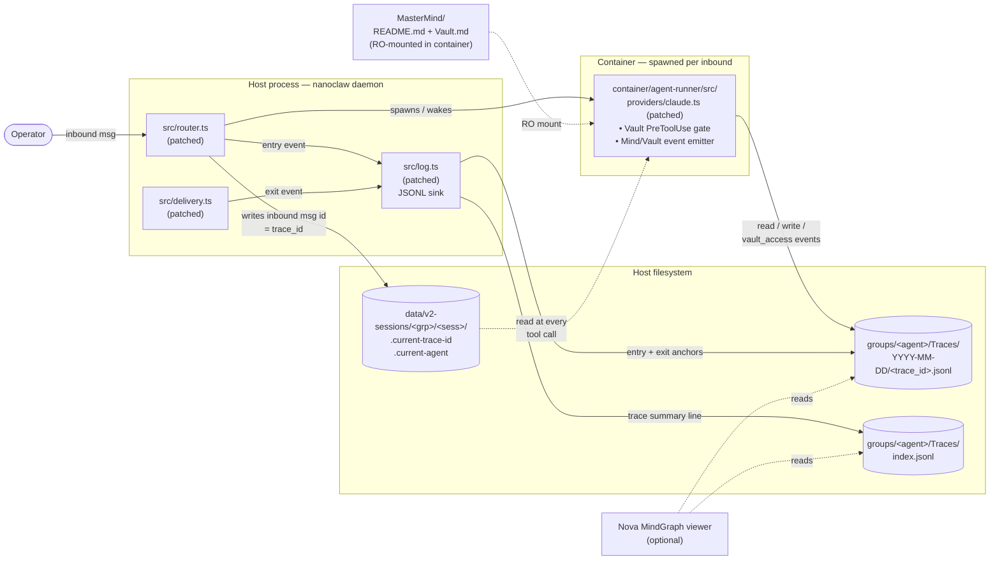

# Capabilities

> **Scope:** this overlay is built **specifically for [`qwibitai/nanoclaw` v2](https://github.com/qwibitai/nanoclaw)** (the 2.0.x line). It does **not** apply to nanoclaw 1.x, `nanoclaw-pro`, or any other agent runtime. Tested patch baseline: upstream `origin/main` at commit `34f3612` (= `v2.0.17`); minimum supported floor is `v2.0.10`.

A complete walkthrough of what this overlay package contains, what each capability does, and how to use it. If you only have time for one document in this repo, read this one. For installation steps, see [README.md](README.md). For provenance (what diffs vs upstream), see [PHASE-A-CATALOG.md](PHASE-A-CATALOG.md).

## Contents

1. [Orientation](#orientation)
2. [Architecture overview](#architecture-overview)
3. [Data flow: how an inbound message becomes a trace](#data-flow-how-an-inbound-message-becomes-a-trace)
4. [Capability 1 — Tracing (host + container, JSONL)](#capability-1--tracing-host--container-jsonl)
5. [Capability 2 — Vault gate (PreToolUse path enforcement)](#capability-2--vault-gate-pretooluse-path-enforcement)
6. [Capability 3 — Nova MindGraph wiring](#capability-3--nova-mindgraph-wiring)
7. [Capability 4 — MasterMind starter pack](#capability-4--mastermind-starter-pack)
8. [Capability 5 — Wiki conventions (Karpathy-style frontmatter)](#capability-5--wiki-conventions-karpathy-style-frontmatter)
9. [File map](#file-map)
10. [Operator workflow](#operator-workflow)
11. [**For Claude: integration playbook**](#for-claude-integration-playbook)
12. [**Starting the servers (nanoclaw + Nova)**](#starting-the-servers-nanoclaw--nova)
13. [**Creating a new agent end-to-end**](#creating-a-new-agent-end-to-end)
14. [Glossary](#glossary)

---

## Orientation

This is an overlay for [`qwibitai/nanoclaw` v2](https://github.com/qwibitai/nanoclaw) — a Docker-per-message agent runtime. The overlay adds **observability** (per-request JSONL traces) and **safety** (a per-agent Vault gate at the tool boundary), wires those into an optional [Nova MindGraph](#capability-3--nova-mindgraph-wiring) viewer, and ships a small **MasterMind starter pack** plus **wiki conventions** that agents read at runtime to keep their behavior consistent.

The five capabilities ship as one installable bundle. After install, the operator gets:

- A JSONL trace per inbound message, on disk, ready for any viewer.
- Hard rejection of cross-agent Vault path access at the tool-call boundary.
- (If Nova is present) a per-agent left-panel with that agent's wiki + traces.
- A starter `MasterMind/` folder with conventions every agent reads.
- A documented frontmatter shape for agent Mind pages (drives the MindGraph viewer).

The bundle does **not** include nanoclaw itself, channel adapters (Discord/Slack/etc), Nova itself, agent identities, or any runtime credentials.

---

## Architecture overview

The overlay touches three planes: the host nanoclaw daemon, the per-message container, and the (optional) Nova viewer. They communicate through the host filesystem — JSONL files for events and small **sentinel files** to pass per-invocation context from host to container.



**Solid arrows** are write paths. **Dotted arrows** are reads. Everything coordinates via the filesystem — no extra IPC, no new ports, no new daemons.

The five patched files are the only code-level surface area; everything else (MasterMind, wiki conventions, Nova entries) is text the operator and the agents consume.

---

## Data flow: how an inbound message becomes a trace

Walking through one round-trip:

```mermaid
sequenceDiagram
    actor Op as Operator
    participant R as router.ts
    participant L as log.ts
    participant FS as Filesystem
    participant C as Container (claude.ts)
    participant D as delivery.ts

    Op->>R: inbound message<br/>(id = msg-abc123)
    R->>L: log({trace: {trace_id: msg-abc123, event: 'entry'}})
    L->>FS: append entry to<br/>Traces/2026-04-29/msg-abc123.jsonl
    L->>FS: append summary to<br/>Traces/index.jsonl
    R->>FS: write .current-trace-id = msg-abc123<br/>write .current-agent = &lt;scope&gt;
    R->>C: spawn / wake container

    Note over C: Agent reads MasterMind/<br/>and its own Mind/

    C->>FS: PreToolUse hook reads sentinels
    C-->>C: tool call — Read Mind/Soul.md
    C->>FS: append read event<br/>to Traces/.../msg-abc123.jsonl
    C-->>C: tool call — Read /workspace/vault/file.pdf<br/>(own Vault, allowed)
    C->>FS: append vault_access event<br/>+ touch .trace-forced marker
    C-->>C: tool call — Read /workspace/agent/Vault/other.pdf<br/>(another agent's Vault)
    C->>C: PreToolUse returns decision: 'block'
    C->>FS: append vault_access event<br/>(decision: block)

    Note over C: Agent finishes, container returns

    C->>D: outbound message
    D->>L: log({trace: {trace_id: msg-abc123, event: 'exit'}})
    L->>FS: append exit anchor to<br/>Traces/.../msg-abc123.jsonl
    D->>Op: deliver outbound
```

**Two-layer event emission.** Anchor events (`entry`, `exit`) come from the host (router + delivery → log). Intermediate events (`read`, `write`, `vault_access`) come from the container's PreToolUse hook in `claude.ts`. They share the same `trace_id` because the container reads it from the sentinel file the host wrote moments before spawning it.

**Why sentinels and not env vars or stdin?** Containers in nanoclaw v2 are coalesced — the same container can answer multiple inbounds in succession to amortize spawn cost. Env vars would be set once at spawn; sentinels are re-written by the host on every inbound, so the container always sees the trace_id of the *current* inbound, not the one that spawned it.

---

## Capability 1 — Tracing (host + container, JSONL)

**What it gives you:** every inbound message produces one JSONL file on disk capturing the agent's full audit trail — every Mind page read or written, every Vault touch (allowed or blocked), and entry/exit anchors. Plus an `index.jsonl` summary file the viewer can scan without opening every trace.

**Where it lives in the bundle:**

- `src/patches/01-log.ts.patch` — JSONL sink + helper exports (`recordInboundForSession`, `traceIdForSession`, `entryNodeForAgentFolder`, `traceScopeForAgentFolder`, `writeTraceSentinels`).
- `src/patches/02-router.ts.patch` — calls those helpers, writes sentinels, emits `entry` event per inbound.
- `src/patches/03-delivery.ts.patch` — emits `exit` event per outbound, paired by `trace_id` with the most-recent inbound.
- `src/patches/04-claude.ts.patch` — container-side intermediate event emitter (Mind page reads/writes, vault accesses). Mind detection supports both layouts: flat group-root files (`/workspace/agent/Soul.md`) and modern `Mind/` subfolder (`/workspace/agent/Mind/Soul.md`, `/workspace/agent/Mind/me/raju.md` etc., with subpaths flattened in slug as `me_raju`).
- `src/patches/05-container-runner.ts.patch` — three-layer separation. In the per-agent nested install model (`<project>/<RoleFolder>/nanoclaw-v2/`), binds the agent-layer `Mind/Vault/Traces` directly inside `/workspace/agent` so container writes through the relative symlinks at `groups/<folder>/{Mind,Vault,Traces}` reach the agent layer (not a real-dir replacement inside the container's bind-mount sandbox). Heuristic: only fires when the parent of cwd has the sibling dir; shared-install model is unaffected.

**What gets created at runtime:**

```
<nanoclaw>/groups/<agent_folder>/Traces/
├── 2026-04-29/
│   ├── msg-abc123.jsonl       ← one file per inbound
│   ├── msg-def456.jsonl
│   └── ...
├── 2026-04-30/
│   └── ...
└── index.jsonl                 ← one summary line per trace, append-only

<nanoclaw>/data/v2-sessions/<agent_group_id>/<session_id>/
├── .current-trace-id           ← inbound msg id (re-written every route)
├── .current-agent              ← agent scope name
└── .trace-forced               ← appended when own-Vault read forces tracing
```

**Example trace file content** (one inbound, four events):

```jsonl
{"trace_id":"msg-abc123","timestamp":"2026-04-29T15:06:00.100Z","agent":"myagent","node_id":"myagent:soul","event":"entry","request_summary":"Summarize today's HN posts about distributed systems"}
{"trace_id":"msg-abc123","timestamp":"2026-04-29T15:06:00.421Z","agent":"myagent","node_id":"myagent:goal","event":"read"}
{"trace_id":"msg-abc123","timestamp":"2026-04-29T15:06:01.123Z","agent":"myagent","node_id":"myagent:vault:somefile","event":"vault_access","metadata":{"decision":"allow","reason":"own-vault auto-trace"}}
{"trace_id":"msg-abc123","timestamp":"2026-04-29T15:06:02.500Z","agent":"myagent","node_id":"myagent:soul","event":"exit","metadata":{"response_length":312}}
```

**Event types** the harness emits:

| Event | Emitted by | When |
|---|---|---|
| `entry` | `router.ts` (host) | Once, on inbound route |
| `read` | `claude.ts` (container) | Each tool call that reads a Mind `.md` page |
| `write` | `claude.ts` (container) | Each tool call that writes a Mind `.md` page |
| `vault_access` | `claude.ts` (container) | Each tool call touching a Vault path (allowed or blocked) |
| `exit` | `delivery.ts` (host) | Once, on outbound delivery, paired with `entry` by trace_id |

**How to use it:**

- **Tail traces live:** `tail -F <nanoclaw>/groups/<agent>/Traces/$(date +%Y-%m-%d)/*.jsonl | jq .`
- **Audit a single inbound:** `cat <nanoclaw>/groups/<agent>/Traces/<date>/<trace_id>.jsonl | jq .`
- **Index scan:** `tail -50 <nanoclaw>/groups/<agent>/Traces/index.jsonl | jq .` — recent activity in summary form.
- **Wire into Nova:** see [Capability 3](#capability-3--nova-mindgraph-wiring) — Nova reads these JSONL files directly.

**Configuration / env vars:**

- `TRACING_ENABLED` — already documented by nanoclaw + in `MasterMind/README.md`. When `!= 'true'`, agents skip emitting events from inside the container (host anchors still fire). Set in `~/.config/nanoclaw/tracing.json` per nanoclaw convention.
- No new env vars introduced by this overlay.

**Customizing scopes** (how agent folder names map to trace `node_id` prefixes): edit `entryNodeForAgentFolder()` and `traceScopeForAgentFolder()` in the patched `src/log.ts` after install. The baseline ships with no per-folder overrides — every agent folder gets `<folder>:claude.local` as its entry node and `<folder>` as its scope. To anchor a particular agent's traces on `<scope>:soul` instead (recommended once that agent has a `Mind/Soul.md`), add a one-line override; `scripts/new-agent.sh` prints the exact snippet for each agent it scaffolds.

---

## Capability 2 — Vault gate (PreToolUse path enforcement)

**What it gives you:** a hard gate at the tool-call boundary that blocks an agent from reading or writing another agent's Vault. Implements rules 1 and 5 from `MasterMind/Vault.md` (per-agent isolation + own-vault auto-force-trace).

**Where it lives in the bundle:**

- `src/patches/04-claude.ts.patch` — adds `extractVaultPaths`, `isOwnVaultPath`, `evaluateVaultPath`, `markTraceForced` helpers, plus the PreToolUse hook integration.
- `templates/MasterMind/Vault.md` — the rule statements the gate enforces.

**Behavior:**

- An agent's **own Vault** lives at `/workspace/vault/` (per-attachment, RO-mounted by nanoclaw) and `/workspace/agent/Vault/` (the agent's group folder Vault, if it exists).
- A tool call (`Read`, `Write`, `Edit`, or `Bash` with a vault-shaped path) is intercepted in PreToolUse:
  - **Path is in own Vault** → call proceeds. A `vault_access` event with `decision: 'allow'` is emitted, and `.trace-forced` is touched (rule 5: own-vault read auto-forces tracing for the rest of the spawn).
  - **Path looks like another agent's Vault** → call is blocked with a `decision: 'block'` return; agent receives a `stopReason` explaining why and what to do instead.
  - **Path is unrelated to any Vault** → call passes through silently.

**Example block message** the agent sees:

```
Vault rule 1 (per-agent isolation): you may not access "/workspace/agent/Vault/other-agent-secret.pdf" — that's another agent's Vault, or a path that looks like one. If you genuinely need this, ask the operator directly per MasterMind/Vault.md (no agent→agent vault transfer).
```

**Example trace event** when a block fires:

```jsonl
{"trace_id":"msg-abc123","timestamp":"2026-04-29T15:07:14.200Z","agent":"agent-a","node_id":"agent-a:vault:cross-agent-block","event":"vault_access","metadata":{"decision":"block","reason":"cross-agent vault path","path":"/workspace/agent/Vault/other-agent-secret.pdf"}}
```

**How to test the gate works:**

After install, exercise it manually:

1. Spin up two agents (e.g. `agent-a` and `agent-b`).
2. From the `agent-b` channel, send a message asking agent-b to `Read /workspace/agent/Vault/other-agent-secret.pdf` (or any path with `Vault/` and another agent's name).
3. Confirm: agent reports "I can't read that — Vault rule 1 …" and the trace JSONL contains a `vault_access` event with `decision: 'block'`.

**Configuration:** none. Path matching is rule-driven, not config-driven. The five hard rules are enumerated in `MasterMind/Vault.md` (shipped in `templates/MasterMind/Vault.md`) — agents read them at startup.

**What the gate does NOT do:**

- Does not encrypt Vault contents (it's an access policy, not a data-at-rest control).
- Does not mediate host-side reads — only container tool calls.
- Does not stop network exfiltration (rule 4 is documented; no enforcement code ships in this overlay).

---

## Capability 3 — Nova MindGraph wiring

**What it gives you:** the [Nova MindGraph viewer](nova/) — vendored in this repo at `nova/` and copied per-project at bootstrap time — renders an interactive graph of every agent's Mind plus a left-panel timeline of traces. The harness install script (`scripts/install-harness.sh` with `--nova=PATH`) and `scripts/new-agent.sh` append scope entries to Nova's `roots.ts` and `trace-sources.ts` so registered agents show up in the left panel with both their wiki *and* their JSONL traces.

**Where it lives in the bundle:**

- `scripts/install-harness.sh` — the awk-insert logic (lines around `insert_nova_entries`). No bundled `.ts` files; entries are generated inline because they need absolute paths to the operator's nanoclaw groups.

**What it does** when the operator passes `--nova=PATH`:

1. Confirms `<nova>/packages/mindgraph/src/roots.ts` and `trace-sources.ts` exist.
2. (Removed in the baseline restructure — Nova registration is now per-agent via `scripts/new-agent.sh`.)
3. Otherwise, inserts two entries before the closing `];` of each file's `return [...]` array, with absolute paths derived from `--nanoclaw=`.

**Generated entries** (for nanoclaw at `/path/to/nanoclaw-v2`):

```ts
// roots.ts
{ scope: "myagent", label: "My Agent", path: "/path/to/nanoclaw-v2/groups/myagent" },
{ scope: "anotheragent", label: "Another Agent", path: "/path/to/nanoclaw-v2/groups/anotheragent" },

// trace-sources.ts
{ scope: "myagent", label: "My Agent", path: "/path/to/nanoclaw-v2/groups/myagent/Traces" },
{ scope: "anotheragent", label: "Another Agent", path: "/path/to/nanoclaw-v2/groups/anotheragent/Traces" },
```

**How to use it:**

- `--nova=/path/to/your/nova` on the install command. Skip the flag if you don't have Nova.
- After install, restart Nova; the new agents appear in the left panel.
- To register agents, use `scripts/new-agent.sh --project=PATH --name=AgentName` (it handles the awk-insert per agent). To rename or remove, edit `roots.ts` and `trace-sources.ts` directly.

**What this wiring does NOT do:**

- Does not install Nova. The operator brings their own Nova checkout.
- Does not register v1 agents — those are out of scope.
- Does not patch any other Nova file. The full Nova trace viewer + D3 graph render are Nova's own concern.

---

## Capability 4 — MasterMind starter pack

**What it gives you:** two markdown files (`README.md` and `Vault.md`) the operator drops into `MasterMind/` on their machine. Every agent in the fleet RO-mounts this folder and reads it at session start. The pack documents the wiki conventions, the tracing schema, and the five Vault rules — i.e. the runtime behaviors agents are expected to follow.

**Where it lives in the bundle:**

- `templates/MasterMind/README.md` — the master ground-rules doc. Sections: Invariants, Protocols, MindGraph Conventions, Fleet Topology, Request Tracing, Confidential Files (pointer to Vault.md).
- `templates/MasterMind/Vault.md` — the five Vault rules + cross-agent request workflow + violation consequence.

**Install behavior:** `scripts/install-harness.sh` copies these into the operator's `--mastermind=PATH` directory **only if missing**. Existing files are never overwritten. This means:

- A fresh install bootstraps the operator's MasterMind from the bundle.
- A re-install after the operator has customized `MasterMind/` is a no-op for these two files (operator's edits stay).

**The bundled copy uses neutral phrasing** ("the operator", "your channel") instead of any specific operator name, so agents installed by friends don't refer to someone else by name. The operator can sed-replace "the operator" with their own name after install if they prefer.

**How agents use it at runtime:**

The container's bind-mount config (set up by nanoclaw, not by this overlay) RO-mounts `MasterMind/` into `/workspace/MasterMind/` (or equivalent). Each agent's session-start protocol — defined in the agent's own `Mind/` folder, conventionally a `protocols.md` or similar — reads `MasterMind/README.md` and `MasterMind/Vault.md` so the rules load before the agent does any work. The Karpathy-wiki convention (described in `MasterMind/README.md` itself) is what makes this bootstrapping coherent.

**How the operator extends it:**

`MasterMind/` is intentionally minimal at install. As the fleet grows, the operator (or a designated master agent — Personal Assistant in the source project) appends new sections: fleet topology updates, new shared protocols, additional rules. The overlay never updates `MasterMind/` after the initial install.

---

## Capability 5 — Wiki conventions (Karpathy-style frontmatter)

**What it gives you:** a documented frontmatter shape every agent's Mind page uses, so the collective fleet wiki is a queryable knowledge graph (typed nodes, named edges, cross-agent references). This is what makes the Nova MindGraph viewer renderable — without consistent frontmatter there's no graph to view.

**Where it lives in the bundle:**

- `templates/MasterMind/README.md` § "MindGraph Conventions" (lines ~56–154) — the schema, valid types, ID scopes, edge relations, worked example, required files.

**Frontmatter schema:**

```yaml
---
type: <type>            # required — see valid types
label: "Human label"    # required — short, readable
id: "<agent>:<slug>"    # recommended — globally unique node ID
properties:             # optional key-value metadata
  key: value
edges:                  # optional — explicit relationships
  - {to: "<scope>:<slug>", relation: "<relation>"}
---
```

**Worked example** (an agent's `Soul.md`):

```yaml
---
type: soul
label: "MyAgent — Identity & Voice"
id: "myagent:soul"
properties:
  version: 1
  last_updated: "2026-04-29"
edges:
  - {to: "myagent:goal", relation: "supports"}
  - {to: "mastermind:readme", relation: "governed_by"}
  - {to: "jarvis:roster", relation: "coordinates_via"}
---
```

**Valid `type` values:** `soul`, `goal`, `memory`, `project_doc`, `ground_rule`, `decision`, `tool`, `channel`, `wiki`. Full list with semantics in `templates/MasterMind/README.md`.

**Standard edge `relation` values:** `supports`, `constrained_by`, `governed_by`, `inherits_rules`, `part_of`, `catalogs`, `delegates_to`, `delegates_from`, `implements`, `informs`, `calibrated_by`, `distills`, `generates`, `produces`, `closes`, `paired_with`, `mentions`, `coordinates_via`, `reports_to`, `coordinates`, `hands_off_to`. Invent new ones only when nothing fits — and document them.

**Required Mind files per agent:**

| File | `type:` | Purpose |
|------|---------|---------|
| `Soul.md` | `soul` | Identity and voice |
| `Goal.md` | `goal` | Purpose and scope |
| `index.md` | `wiki` | Catalog of all Mind pages |
| `log.md` | `wiki` | Append-only activity log |

Anything beyond these four is at the agent's discretion.

**Inline references** — `[[slug]]` and `[text](./path)` in body text are auto-detected as implicit `mentions` edges. No need to list them in `edges:`.

**How the operator uses this:**

- When a new agent is created, the operator (or the master agent) ensures the agent's Mind starts with the four required files, each with frontmatter.
- The agent itself appends to its Mind over time, following the schema.
- If the operator runs Nova, the graph view validates the schema visually — broken edges and untyped nodes show up immediately.

**What this convention does NOT enforce in code:**

- The harness does not lint the frontmatter. Compliance is convention-driven, not check-driven.
- Nothing in the patches will reject a non-compliant Mind page; it just won't render usefully in MindGraph.

---

## File map

```
nanoclaw-harness/
├── CLAUDE.md                                  Bootstrap — read first if you're an LLM.
├── CAPABILITIES.md                            This file. The full walkthrough.
├── README.md                                  Install + prereqs + caveats. Operator entry point.
├── PHASE-A-CATALOG.md                         File-by-file diff catalog vs upstream nanoclaw.
│                                              Read for provenance / debugging.
├── LICENSE                                    MIT.
├── .claude/
│   └── skills/
│       └── add-harness/
│           └── SKILL.md                       Slash-command operator doc. Used by Claude Code
│                                              when /add-harness is invoked.
├── setup/
│   └── install-harness.sh           Idempotent installer. Runs git apply, copies
│                                              MasterMind, awk-inserts Nova entries, builds.
└── src/
    ├── patches/                               Five git apply patches against nanoclaw v2.
    │   ├── 01-log.ts.patch                    Tracing — JSONL sink + helper exports.
    │   ├── 02-router.ts.patch                 Tracing — entry events + sentinel writes.
    │   ├── 03-delivery.ts.patch               Tracing — exit events.
    │   ├── 04-claude.ts.patch                 Vault gate + container-side event emitter
    │   │                                      (supports flat + Mind/ subfolder layouts).
    │   └── 05-container-runner.ts.patch       Three-layer Mind/Vault/Traces nested binds
    │                                          for the per-agent nested install model.
    └── mastermind/                            MasterMind starter pack (copied to operator's
        │                                      MasterMind/ on install if missing).
        ├── README.md                          Wiki conventions, tracing schema, fleet rules.
        └── Vault.md                           Five Vault rules + cross-agent workflow.
```

**By size and importance:**

- **Largest by line count:** `PHASE-A-CATALOG.md` (~420 lines), `CAPABILITIES.md` (this file), `templates/MasterMind/README.md` (~310 lines).
- **Most important to read for understanding:** `CAPABILITIES.md`, then `templates/MasterMind/README.md` (the runtime conventions).
- **Most important to read for debugging:** `PHASE-A-CATALOG.md` plus the five `.patch` files in `src/patches/`.
- **Most important for installing:** `README.md` + `scripts/install-harness.sh`.

---

## Operator workflow

A typical lifecycle:

**1. Install.** Operator clones this repo, runs:

```bash
./scripts/install-harness.sh \
  --nanoclaw=/path/to/nanoclaw-v2 \
  --mastermind=/path/to/MasterMind \
  --nova=/path/to/Nova           # optional
```

The script applies five patches, copies MasterMind starter files (if missing), inserts Nova entries (if `--nova` given), and rebuilds nanoclaw.

**2. Restart nanoclaw.** `launchctl kickstart -k gui/$UID/com.nanoclaw` (macOS) or `systemctl --user restart nanoclaw` (Linux).

**3. First trace.** Send any inbound to any wired agent. Confirm:

```bash
ls $NANOCLAW/groups/<agent>/Traces/$(date +%Y-%m-%d)/
tail -1 $NANOCLAW/groups/<agent>/Traces/index.jsonl | jq .
```

A new JSONL file should exist; the index should have one new line.

**4. Vault test (optional but recommended).** Spin up two agents. From agent A, send a message asking it to read agent B's Vault path. Confirm the agent reports the rule-1 block and the JSONL contains a `vault_access` event with `decision: 'block'`.

**5. Day-to-day.** Operator does nothing — traces accumulate as a side effect of normal agent operation. Vault gate enforces silently. Nova viewer (if wired) shows live activity.

**6. Adding a new agent.** Operator creates the agent group folder under `<nanoclaw>/groups/`, populates the agent's `Mind/` with the four required files (Soul, Goal, index, log) per the [wiki conventions](#capability-5--wiki-conventions-karpathy-style-frontmatter), and (if the agent's folder name isn't a default mapping) edits `entryNodeForAgentFolder()` in the patched `src/log.ts` to give it a stable scope.

**7. Upgrading nanoclaw.** Pull upstream nanoclaw, then re-run the install script. The patches will fail to apply if upstream has changed the lines they touch — operator resolves manually (the patch files are plain unified diffs, readable in any editor).

**8. Uninstalling.** `cd <nanoclaw> && git apply --reverse <overlay>/src/patches/*.patch && pnpm install && pnpm run build`. MasterMind starter files stay (operator may have customized them); delete by hand if desired.

---

## For Claude: integration playbook

This section is written for an LLM (Claude or otherwise) helping an operator install, integrate, or troubleshoot this overlay. If you're a human reader, skip to the [Glossary](#glossary).

### What you're working with

The operator already has a working **nanoclaw v2** install (cloned from `qwibitai/nanoclaw`, on or past `v2.0.10`). They want to add observability + Vault safety on top. This overlay applies as `git apply` patches against the four files listed in [Capability 1](#capability-1--tracing-host--container-jsonl) and [Capability 2](#capability-2--vault-gate-pretooluse-path-enforcement). The overlay is **non-destructive**: it never deletes nanoclaw functionality, never adds npm dependencies, and is fully reversible via `git apply --reverse`.

### Before you start — questions to ask the operator

1. **Where is your nanoclaw v2 checkout?** (You'll pass this as `--nanoclaw=PATH`.) Confirm it's a git clone (not a tarball download), since the installer uses `git apply`. Confirm `git status` shows a clean working tree on the four target files — uncommitted local edits to those files will conflict.
2. **Where is your MasterMind folder?** (Or: do you want me to create one?) If they don't have one, default to `<nanoclaw_parent>/MasterMind/`. The installer creates it if missing.
3. **Do you have Nova installed?** If yes, get the path (`--nova=PATH`). If no, skip Nova wiring; they can re-run the installer with `--nova=` later.
4. **What are your agent group folder names?** Look at `<nanoclaw>/groups/`. The baseline patches don't hardcode any folder mappings — every folder anchors traces on `<folder>:claude.local` by default. If you want agents anchored on their `Soul.md` instead (recommended), add per-folder overrides in `entryNodeForAgentFolder()` and `traceScopeForAgentFolder()` in the patched `src/log.ts`. `scripts/new-agent.sh` prints the override snippet for each agent it scaffolds.

### Installation sequence

```bash
# From the overlay repo root:
./scripts/install-harness.sh \
  --nanoclaw=/path/to/nanoclaw-v2 \
  --mastermind=/path/to/MasterMind \
  --nova=/path/to/Nova       # omit if no Nova
```

The installer is **idempotent** — re-running is safe and skips work that's already done. Each step prints either `[ok]` or `[skip]`.

If `git apply --check` fails for any patch, the operator's checkout has diverged from the patch baseline (upstream `qwibitai/nanoclaw` `~v2.0.17`). Two recovery paths:

- **If they have local edits to the patched files:** read the conflicting hunks (`src/patches/0X-*.patch` is a plain unified diff), merge by hand into their version of the file, and re-run with `--skip-build`. Do not blindly `git apply --3way` — the harness changes are subtle (especially the `claude.ts` PreToolUse hook integration) and three-way merge can produce silently broken behavior.
- **If they're on a much newer or older nanoclaw version:** ask the operator to share their `git log -1 --oneline` for upstream `qwibitai/nanoclaw`. If they're past v2.0.x or before v2.0.10, this overlay isn't tested against their version — flag the risk before proceeding.

### Verifying the install

After the installer reports success and `pnpm run build` succeeds:

1. Run `pnpm test` in the nanoclaw checkout. Expect 215+ tests passing, 0 failing. If tests fail, the patches are interfering with something else in the operator's tree — investigate before declaring success.
2. Restart the nanoclaw service ([see below](#starting-the-servers-nanoclaw--nova)).
3. Send any inbound through any wired channel. Confirm `<nanoclaw>/groups/<agent>/Traces/$(date +%Y-%m-%d)/<some-id>.jsonl` exists and contains at least an `entry` and `exit` event with the same `trace_id`.

If trace files don't appear:
- Check the agent's `TRACING_ENABLED` env var. The harness respects nanoclaw's existing tracing toggle. Look in `~/.config/nanoclaw/tracing.json`.
- Check the daemon logs (`launchctl list | grep nanoclaw` then `tail -F` the relevant log path). The host emits errors silently to the JSONL but should still log via `log.warn` if the trace dir is unwritable.

### How this overlay helps with creating agents

Once installed, each new agent the operator creates inherits five things automatically:

- **Audited memory access.** Every Mind page read or written by the agent is captured in the trace JSONL. The operator can review what an agent actually read before it answered, not just the answer.
- **Vault isolation by default.** Even if the agent's prompt forgets the rules, the PreToolUse gate physically blocks it from reading another agent's Vault. There's no path-traversal trick or prompt-injection that bypasses this — it's enforced in `claude.ts` before the SDK even sees the tool call.
- **Compatible wiki shape.** Following the [wiki conventions](#capability-5--wiki-conventions-karpathy-style-frontmatter) means the agent's Mind plugs into the MindGraph viewer the moment it's created. No extra setup.
- **Convention bootstrap.** The agent's container RO-mounts `MasterMind/`, so on session start the agent reads the wiki conventions, the tracing schema, and the Vault rules. The agent doesn't need to be re-told these per-session.
- **Cross-agent delegation context.** The wiki conventions encode a fleet topology (master agent + peers). Agents can route work to each other through documented edges (`coordinates_via`, `delegates_to`, `hands_off_to`) — the harness doesn't enforce this, but the conventions establish the shape.

See [Creating a new agent end-to-end](#creating-a-new-agent-end-to-end) for the step-by-step.

### How NOT to use this

- **Don't apply this to nanoclaw 1.x.** The container model is different; the patches assume v2's `agent-runner` module structure and won't apply.
- **Don't apply this to a fork of nanoclaw with major divergence from upstream main.** The patches target specific lines; if a fork has rewritten those, manual merge is required.
- **Don't expect this to mediate network calls.** The Vault gate is filesystem-tool-call only. If you need to stop an agent from POSTing Vault contents to an external API, you need a separate egress policy (not in this overlay).
- **Don't edit `MasterMind/` files in the operator's `Mind/` folders.** Per the convention shipped here (Karpathy invariant), only the agent writes to its own Mind. Operator edits should go through a designated master agent (Personal Assistant, Jarvis, etc.) with explicit approval per write.

---

## Starting the servers (nanoclaw + Nova)

### nanoclaw daemon

After install + `pnpm run build`, nanoclaw runs as a long-lived host process. The right start command depends on how the operator installed it.

**If they installed with launchd / systemd (typical production setup):**

```bash
# macOS — kickstart restarts the existing service:
launchctl kickstart -k "gui/$(id -u)/com.nanoclaw"

# Linux — systemd:
systemctl --user restart nanoclaw
# or, for a system-level install:
sudo systemctl restart nanoclaw
```

If the service doesn't exist yet, the operator hasn't completed nanoclaw's own setup. Point them at nanoclaw's `pnpm run setup` (interactive setup wizard) or `pnpm run setup:auto` (scripted) — both ship with nanoclaw, not with this overlay. Setup provisions the OneCLI Vault for credentials and registers the launchd / systemd service.

**For development (foreground, no daemon):**

```bash
cd /path/to/nanoclaw-v2
pnpm run dev          # tsx src/index.ts — auto-reloads on file change
```

This is fine for testing the overlay end-to-end but doesn't survive a terminal close.

**Verifying the daemon picked up the new build:**

After restart, send any inbound. The first trace JSONL should appear within seconds in `<nanoclaw>/groups/<agent>/Traces/$(date +%Y-%m-%d)/`. If it doesn't, the daemon is likely still running the pre-patch build:

```bash
launchctl list | grep nanoclaw          # is it actually running?
ps aux | grep nanoclaw                  # which dist/index.js path?
ls -la /path/to/nanoclaw-v2/dist/index.js   # is the build fresh?
```

A common gotcha: launchd caches the binary path; if the operator moved their nanoclaw checkout, `launchctl bootout` + reload the plist.

### Nova MindGraph viewer

Nova is a **separate** application — not bundled here, not installed by this overlay. The overlay only registers v2 agent paths in Nova's `roots.ts` / `trace-sources.ts` if `--nova=PATH` was passed at install time.

**Starting Nova** (assuming the operator has a Nova checkout):

```bash
cd /path/to/Nova
pnpm install          # first time only
pnpm run dev          # starts the Next.js dev server, typically on :3000
```

Then open the URL Nova prints (usually `http://localhost:3000`). The left panel should show every registered agent (v1 + the new v2 entries). Clicking an agent loads its Mind graph and trace timeline.

**If the v2 agents don't appear in Nova:**

1. Check that the install script actually inserted the entries:
   ```bash
   grep '"v2-' /path/to/Nova/packages/mindgraph/src/roots.ts
   grep '"v2-' /path/to/Nova/packages/mindgraph/src/trace-sources.ts
   ```
2. If the lines are present but Nova still doesn't render them, check that the path on disk exists and is readable:
   ```bash
   ls /path/to/nanoclaw-v2/groups/myagent/         # should exist
   ls /path/to/nanoclaw-v2/groups/myagent/Traces/  # may be empty until first inbound
   ```
3. Restart Nova (`pnpm run dev` reloads on file change but the registry is read once).

**If Nova fails to start at all:** check Node version (Nova requires the same `>=20` as nanoclaw), check for a stale `.next/` cache (`rm -rf .next && pnpm run dev`), and check port `:3000` isn't already taken.

**Nova architecture note for Claude:** the viewer reads the JSONL trace files directly from disk on every request. There's no database, no cache invalidation. If a trace appears in `<nanoclaw>/groups/<agent>/Traces/...` but not in Nova's UI, refresh the browser — Nova will re-scan the directory.

---

## Creating a new agent end-to-end

A worked example: adding a hypothetical agent named `Sona` (finance domain) to a fleet that already has the harness installed.

### 1. Pick a folder name and scope

Folder name = filesystem-friendly identifier under `<nanoclaw>/groups/`. Scope = the prefix in MindGraph node IDs (`<scope>:soul`, etc.). Convention: keep them identical when possible.

For Sona: folder = `sona`, scope = `sona`.

### 2. Map the folder to a scope in `src/log.ts`

Edit the patched `src/log.ts` in the nanoclaw checkout (post-install, this file already has the harness):

```ts
export function entryNodeForAgentFolder(folder: string): string {
  if (folder === 'myagent-folder') return 'myagent-scope:soul';
  if (folder === 'myagent-folder') return 'myagent-scope:soul';
  if (folder === 'sona') return 'sona:soul';        // NEW
  return `${folder}:claude.local`;
}

export function traceScopeForAgentFolder(folder: string): string {
  if (folder === 'myagent-folder') return 'myagent-scope';
  if (folder === 'myagent-folder') return 'myagent-scope';
  if (folder === 'sona') return 'sona';             // NEW
  return folder;
}
```

Skip this step only if you're OK with traces anchoring on `sona:claude.local` instead of `sona:soul` — the fallback works, you just lose the canonical Soul-anchored entry node.

Rebuild: `pnpm run build`.

### 3. Create the agent group folder + Mind scaffolding

```bash
mkdir -p /path/to/nanoclaw-v2/groups/sona/Mind
mkdir -p /path/to/nanoclaw-v2/groups/sona/Vault       # if this agent will hold sensitive docs
mkdir -p /path/to/nanoclaw-v2/groups/sona/Traces      # auto-created on first trace, but pre-creating is fine
```

### 4. Write the four required Mind files

Each file gets frontmatter per the [wiki conventions](#capability-5--wiki-conventions-karpathy-style-frontmatter). Minimal scaffolds:

`groups/sona/Mind/Soul.md`:
```yaml
---
type: soul
label: "Sona — Identity & Voice"
id: "sona:soul"
properties:
  version: 1
  last_updated: "2026-04-29"
edges:
  - {to: "sona:goal", relation: "supports"}
  - {to: "mastermind:readme", relation: "governed_by"}
  - {to: "jarvis:roster", relation: "coordinates_via"}
---

# Sona

(One paragraph in the agent's voice — who they are, how they speak, what they care about. The agent expands this themselves over time; this is just the seed.)
```

`groups/sona/Mind/Goal.md`:
```yaml
---
type: goal
label: "Sona — Purpose & Scope"
id: "sona:goal"
edges:
  - {to: "sona:soul", relation: "part_of"}
---

# Goal

Domain: personal finance. Track expenses, surface anomalies, prepare tax-time summaries. Out of scope: investment advice, account access changes, anything requiring authentication beyond reading user-provided exports.
```

`groups/sona/Mind/index.md`:
```yaml
---
type: wiki
label: "Sona — Mind index"
id: "sona:index"
---

# Index

- [Soul](Soul.md)
- [Goal](Goal.md)
- [log](log.md)
```

`groups/sona/Mind/log.md`:
```yaml
---
type: wiki
label: "Sona — Activity log"
id: "sona:log"
---

# log

Append-only. Sona writes here after each meaningful interaction.
```

### 5. Wire a channel (out of scope for this overlay)

Routing inbound messages to Sona is nanoclaw's concern, not the harness's. Use `pnpm run setup` (interactive) or one of nanoclaw's channel-skill scripts (`/add-discord`, `/add-zoho-cliq`, etc.) to wire the agent group to a channel adapter.

### 6. Register Sona in Nova (if Nova is wired)

Edit `<nova>/packages/mindgraph/src/roots.ts` and add:

```ts
{ scope: "sona", label: "Sona", path: "/path/to/nanoclaw-v2/groups/sona" },
```

And `<nova>/packages/mindgraph/src/trace-sources.ts`:

```ts
{ scope: "sona", label: "Sona", path: "/path/to/nanoclaw-v2/groups/sona/Traces" },
```

Restart Nova. Sona appears in the left panel.

### 7. Restart nanoclaw, send a probe

```bash
launchctl kickstart -k "gui/$(id -u)/com.nanoclaw"   # or systemctl restart
# Send a message through Sona's wired channel.
ls /path/to/nanoclaw-v2/groups/sona/Traces/$(date +%Y-%m-%d)/
```

A JSONL file should exist. Done — Sona is a first-class fleet member.

### What the harness gives Sona for free

- Every read/write of her Mind pages is in the trace.
- Any attempt to read another agent's Vault is blocked at the tool boundary.
- Reading her own Vault auto-forces tracing for the rest of the spawn.
- Her Mind shows up in MindGraph the moment she has Soul.md (assuming Nova wiring).
- She inherits the conventions in `MasterMind/` automatically (mounted RO into her container).

---

## Glossary

- **Agent.** A long-running per-domain assistant in the fleet (one agent per domain — e.g. tech news, travel, security, finance). Lives in its own folder under `<nanoclaw>/groups/`.
- **Agent group folder.** The on-disk directory representing one agent inside nanoclaw. Holds the agent's `Mind/`, `Vault/`, `Traces/`, etc.
- **Container.** The Docker container nanoclaw spawns to run one inbound message. Coalesced — may handle multiple inbounds in succession before idling out.
- **Entry node.** The MindGraph node a trace anchors on. Defaults to `<agent>:soul` (the agent's Soul.md). Configurable via `entryNodeForAgentFolder()`.
- **Fleet.** The operator's collection of agents.
- **Inbound.** A message routed to an agent (Discord DM, CLI socket, Slack, etc.).
- **MasterMind.** A folder of cross-fleet ground rules every agent RO-mounts and reads at startup. The starter pack ships with this overlay; operator extends it over time.
- **Mind.** An agent's own knowledge wiki — markdown files at `<agent_folder>/Mind/`. Karpathy-style: append-only, agent-owned, never edited by humans.
- **MindGraph.** The graph view of the fleet's collective Mind, derived from frontmatter (`type:`, `id:`, `edges:`). Rendered by Nova.
- **Nova.** The optional MindGraph viewer the operator may run alongside nanoclaw. Reads JSONL traces and Mind frontmatter to render an interactive graph.
- **Outbound.** The agent's reply, delivered back through the same channel as the inbound.
- **PreToolUse hook.** A hook in the Claude Agent SDK that fires before every tool call inside the container. The Vault gate runs here.
- **Scope.** The prefix in a node `id` (`myagent:soul` → scope is `myagent`). One scope per agent.
- **Sentinel file.** A small file written to `<nanoclaw>/data/v2-sessions/<grp>/<sess>/` by the host to pass per-invocation context (trace_id, agent name) to the container without an env-var rewrite.
- **Soul / Goal.** The two foundational Mind pages every agent has. Soul = identity and voice. Goal = purpose and success criteria.
- **trace_id.** The inbound message id, reused as the unique key for all events in one round-trip. Same value lands in `entry`, `read`/`write`/`vault_access`, and `exit` events.
- **TRACING_ENABLED.** Existing nanoclaw env var (not introduced by this overlay) that gates whether the container emits intermediate trace events.
- **Vault.** An agent's private folder of sensitive operator-shared documents. Mounted into the container at `/workspace/vault/` (per-attachment) and `/workspace/agent/Vault/` (group folder Vault). Subject to the [Vault gate](#capability-2--vault-gate-pretooluse-path-enforcement).
